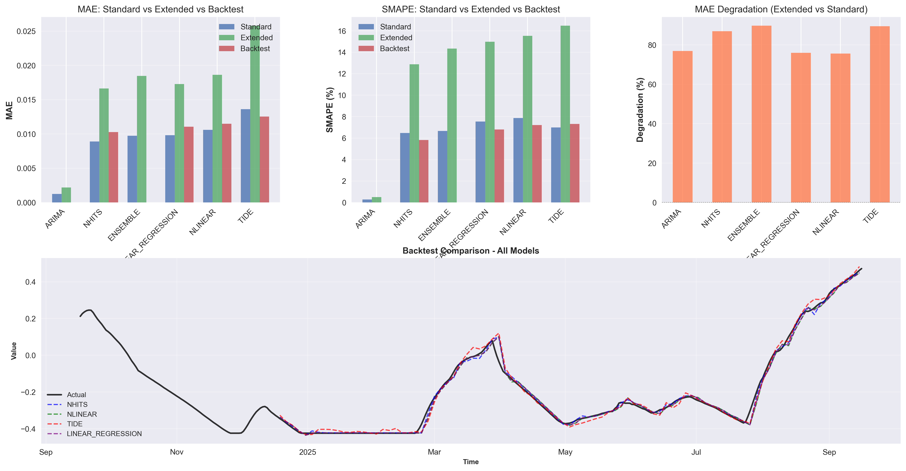
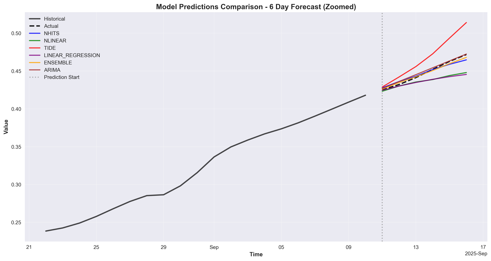

# Improved Kickbase NN
This repo is a remake of [kickbase_nn](https://github.com/ludw1/kickbase_nn) with improvements across the board. About a year ago, kickbase changed their API significantly, which broke the original code. This version addresses that and includes several enhancements:
- **Updated API Integration**: The code now works with the latest Kickbase API, ensuring compatibility.
- **Enhanced Data Handling**: Improved data fetching and processing for better performance.
- **Refined Model Training and more models**: I have learned a lot about time series prediction and neural networks since I wrote the original code. This version includes better model architectures and training techniques. It also includes more models to compare against.
## Example
See [my website](http://ludwig-kraemer.org/kickbase-prediction) for a demonstration of the inference output.
## Getting Started
1. **Clone the Repository**:
   ```bash
   git clone https://github.com/ludw1/new_kickbase_nn.git
   ```
2. **Install Dependencies**:
   Navigate to the cloned directory and install the required packages, depending on whether you want to fetch data or train models:
   ```bash
   cd new_kickbase_nn/get_data or cd ../train_model
   pip install -r requirements.txt
   ```
3. **Configure Data Location** (Optional):
    By default, all data files, checkpoints, logs, and figures will be saved in the current directory. To change the data location, edit `config.py`:
    ```python
    class PipelineConfig:
        DATA_DIR = "/path/to/your/data/directory"  # Change this to your desired location
    ```
    All pipeline steps (data fetching, training, optimization, evaluation) will automatically use this directory.

4. **Set Up Environment Variables**:
    Create a `.env` file in the `get_data` directory with your Kickbase credentials:
    ```
    KICKBASE_USERNAME=your_username
    KICKBASE_PASSWORD=your_password
    ```
5. **Fetch Player Data**:
    Run the data fetching script:
    ```bash
    python main.py
    ```
6. **Train Models**:
    Navigate to the `train_model` directory and run the training script:
    ```bash
    python training.py
    ```
    You can adjust configurations in `config.py` as needed.
7. **Evaluate Models**:
    After training, evaluate the models using:
    ```bash
    python evaluation.py
    ```

## Model Performance Comparison

| Model | MAE (Standard) | SMAPE (Standard) | MAE (Extended) | SMAPE (Extended) | MAE Degradation (%) |
|-------|----------------|------------------|----------------|------------------|---------------------|
| ARIMA | 0.0012 | 0.2677 | 0.0022 | 0.4935 | 76.9261 |
| NHITS | 0.0089 | 6.4764 | 0.0166 | 12.8762 | 86.8777 |
| ENSEMBLE | 0.0097 | 6.6570 | 0.0185 | 14.3367 | 89.6850 |
| LINEAR_REGRESSION | 0.0098 | 7.5471 | 0.0173 | 14.9814 | 75.9944 |
| NLINEAR | 0.0106 | 7.8761 | 0.0186 | 15.5396 | 75.5955 |
| TIDE | 0.0136 | 6.9871 | 0.0258 | 16.4709 | 89.4240 |

*Note: The above table summarizes the performance of various models on testing data. "Standard" refers to the original dataset, "Extended" extends the original prediction time window by a factor of 2 (the standard output size is 3 for all models). MAE Degradation indicates the percentage increase in MAE from Standard to Extended datasets.*

See also these graphs for a visual comparison of the models:


While not conclusive, this result indicates that statistical models like ARIMA may outperform more complex neural networks for this specific time series analysis. Since the data is quite limited however, this conclusion may change with more data.
